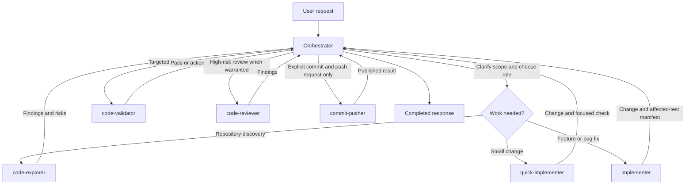

# Victor's portable Codex toolkit

Packages Codex subagents, engineering standards, Impeccable frontend design
guidance, reusable skills (including daily conversation archiving), and opt-in
Git hooks.

## Repository layout

- `AGENTS.md` — Victor's global engineering standards.
- `agents/` — TOML definitions for the available custom agents.
- [Impeccable](https://impeccable.style/) — installed globally for every Codex frontend decision.
- `skills/engineering-quality/` — reusable implementation and review workflow.
- `skills/codex-conversation-archive/` — deterministic, sanitized daily archive
  workflow for visible Codex conversations.
- `automations/` — versioned Codex desktop automation recipes (no local IDs).
- `hooks/` — opt-in Git quality gates for pre-commit and pre-push.
- `opencode/agents/` — native OpenCode Markdown definitions for the same roles.
- `rules/SUBAGENT_ROUTING.md` — delegation, ownership, validation, and role-selection rules.
- `rules/OPENCODE_SUBAGENT_ROUTING.md` — routing rules using OpenCode's native task semantics.
- `templates/AGENTS.md.template` — a manual global-instructions example.
- `apps/codex-token-window/` — an optional GTK/Cairo floating Codex usage widget
  with a local application-menu installer.
- `install.sh` / `uninstall.sh` — guarded installer and remover for Codex.
- `install-opencode.sh` / `uninstall-opencode.sh` — guarded installer and remover for OpenCode.

## Subagent catalog

Use the exact agent name when delegating work.

| Agent | Model / effort | Primary responsibility |
| --- | --- | --- |
| `code-explorer` | GPT-5.6 Luna / low | Read-only repository discovery and decision-ready findings. |
| `quick-implementer` | GPT-5.6 Luna / low | Small, well-scoped one- or two-file changes with focused checks. |
| `implementer` | GPT-5.6 Luna / medium | Features and bug fixes, including targeted unit tests. |
| `code-validator` | GPT-5.4 Mini / low | Read-only, focused test, build, lint, or type-check verification. |
| `code-reviewer` | GPT-5.6 Sol / low | Read-only review for high-risk, public-API, or difficult changes. |
| `commit-pusher` | GPT-5.6 Luna / low | Intentional staging, conventional commit, and push—only on explicit request. |

## Orchestrator workflow

The orchestrator owns scope, integration, and the final outcome. Subagents own
bounded work; they share the same workspace and must preserve unrelated edits.



In brief, exploration and bounded implementation are delegated by default;
validation is separate from implementation; review is for high-risk or
difficult-to-validate changes; and commit/push is only used when explicitly
requested.

The toolkit forbids test-driven development and test-first workflows. Agents
implement the functional change first, then add or update the relevant automated
coverage and run focused validation.

## Prerequisites and configuration

- POSIX `sh` and `python3`.
- Node.js 22.12+ and `npm`, used to install the Codex-tailored Impeccable skill.
- Agent TOML files are validated with Python `tomllib` when available.
- Existing `config.toml` files that require parsing need Python 3.11+
  (`tomllib`) or the installable `tomli` package. A missing parser or malformed
  TOML stops installation before destinations are changed.

Codex files default to `$HOME/.codex`; OpenCode files default to
`$HOME/.config/opencode`. Set `CODEX_HOME` or `OPENCODE_HOME` to override them:

```sh
CODEX_HOME=/path/to/.codex ./install.sh
OPENCODE_HOME=/path/to/opencode ./install-opencode.sh
```

## Install

```sh
./install.sh
./install-opencode.sh
```

The OpenCode installer writes agents to
`$OPENCODE_HOME/agents` (default `~/.config/opencode/agents`), installs the
OpenCode routing rules, and adds a managed import to `AGENTS.md`. Each OpenCode
agent pins the `openai/` equivalent of its Codex model and uses `variant` to
match the Codex reasoning effort. Restart OpenCode after installing because its
configuration is not hot-reloaded.

The installer copies agent definitions to `$CODEX_HOME/agents`, installs the
`engineering-quality` and `codex-conversation-archive` skills, installs the
standards and routing rules, and adds a managed import block to
`$CODEX_HOME/AGENTS.md`. It also runs Impeccable's
official non-interactive installer for the Codex provider at
`$HOME/.agents/skills/impeccable`. Project hooks are not enabled globally; use
`$impeccable hooks on` inside a frontend project when desired. It enables
`[features.multi_agent_v2]` with `hide_spawn_agent_metadata = false` and
`tool_namespace = "agents"` only when that table is not already defined.
Existing files are backed up before being replaced or modified. A state manifest
at `$CODEX_HOME/.subagents_configs-state.json` records ownership and hashes.

Re-running is safe: unchanged managed files remain unchanged, and stale package
files are removed or restored only when their installed bytes still match the
recorded hash. User-modified files are preserved. The installer does not rewrite
an existing multi-agent feature table.

## Uninstall

```sh
./uninstall.sh
./uninstall-opencode.sh
```

The OpenCode command removes package-managed OpenCode files using its independent
state manifest while preserving modified or pre-existing files. Each uninstaller
only affects its corresponding tool.

Uninstall uses the state manifest to remove only package-owned files whose bytes
still match, restoring backups for replaced files. It removes only the exact
managed block from `AGENTS.md` (after making a backup), preserving surrounding
content and edits. The installer-added `config.toml` feature block is
intentionally left in place because ownership cannot be safely proven after
edits. The third-party Impeccable installation is also preserved because it may
have existed before this toolkit or be shared with another Codex setup. If no
valid state manifest exists, nothing is removed.

## Optional Git hooks

The hooks are intentionally not installed automatically. Enable them inside a
repository only when you want these personal gates:

```sh
git config --local core.hooksPath /absolute/path/to/tools/hooks
```

`pre-commit` rejects staged text files over 1000 lines and newly added `TODO` or
`FIXME` markers. Set `PERSONAL_QUALITY_COMMAND` to run a project-specific lint,
format, or type-check command.

`pre-push` requires a project-specific validation command:

```sh
export PERSONAL_TEST_COMMAND='./gradlew test'
```

Use `SKIP_PERSONAL_TESTS=1` only for an intentional, visible bypass. Disable the
hooks with `git config --local --unset core.hooksPath`.

## Optional Codex token window

Run `apps/codex-token-window/launch-token-widget` for the floating usage
window. To install its application-menu entry and icon using the checkout's
actual location, run `apps/codex-token-window/install.sh`; remove only those
managed artifacts with the matching `uninstall.sh`. This component is
independent of the toolkit installer.

## Manual setup and verification

For a manual setup, copy the TOML files into `$CODEX_HOME/agents`, copy both
repository skills into `$CODEX_HOME/skills`, install Impeccable with
`npm exec --yes -- impeccable install -y --providers=codex --scope=global --no-hooks`,
copy `AGENTS.md` and the routing rules into `$CODEX_HOME`, and add the
absolute-path imports shown in `templates/AGENTS.md.template` to
`$CODEX_HOME/AGENTS.md`. Ensure the multi-agent feature table is present in
`$CODEX_HOME/config.toml` if your Codex installation requires it.

After installation, verify the output reports `TOML validation passed` (or the
documented validation skip), inspect the installed files under `$CODEX_HOME`,
and run the installer a second time to confirm it reports unchanged files.

## Daily conversation archive automation

The versioned recipe is
[`automations/codex-conversation-archive.yaml`](automations/codex-conversation-archive.yaml).
It describes a daily 23:30 schedule in `America/Sao_Paulo` and explicitly
invokes `$codex-conversation-archive`. The Codex desktop app creates and
manages the schedule; `install.sh` installs the skill only. Follow the official
Codex desktop automation documentation for creating or editing the task rather
than adding a local scheduler or relying on an undocumented path.

The skill exports only today's visible, unarchived tasks to
`codex-conversations/YYYY/MM/YYYY-MM-DD/`, with one deterministic
`<stable-thread-id>.md` per conversation and an `index.md`, sanitizes secrets
before staging, and confirms the result on `origin/main`. It uses an isolated
clone under the workspace-owned `work` directory, never `/tmp`, and leaves
protected-main pull requests ready for checks and squash merge when policy
prevents a direct push.
